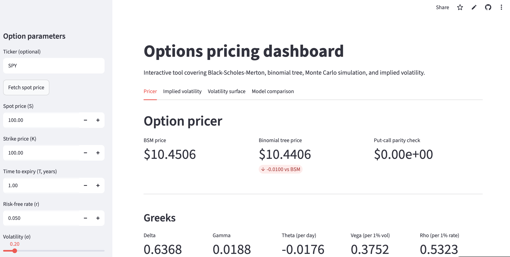
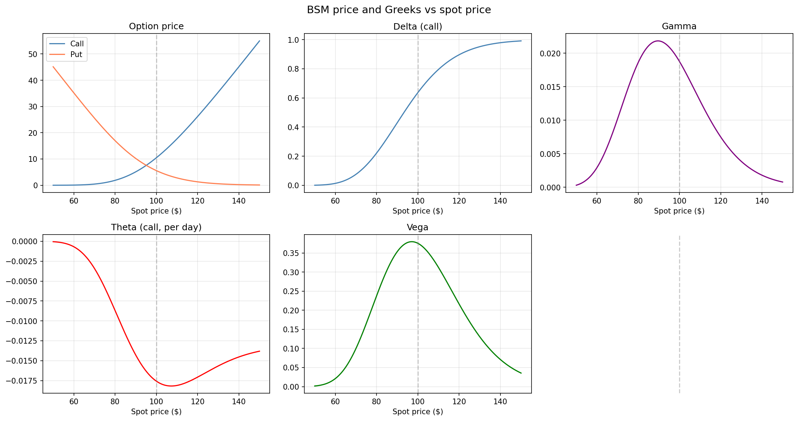
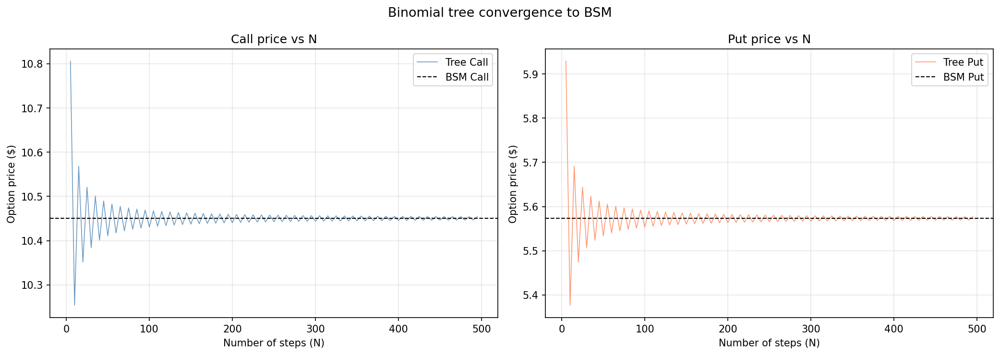
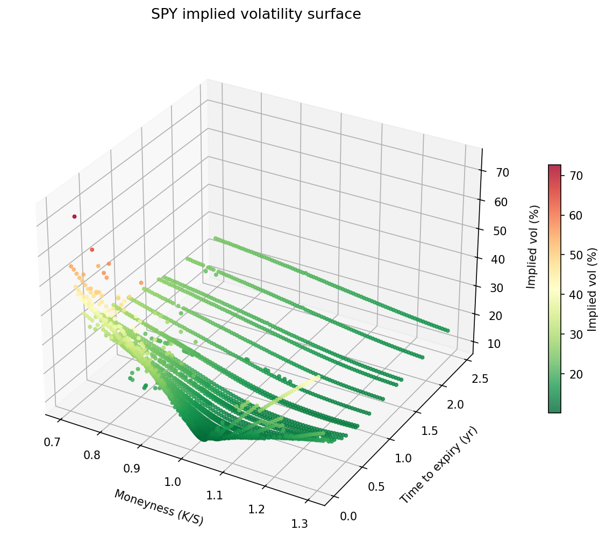

# Options Pricing Engine

A full options pricing engine built in Python, covering Black-Scholes-Merton, binomial trees, Monte Carlo simulation, and implied volatility, with a live interactive dashboard deployed on Streamlit Cloud.

**[Launch the dashboard →](https://options-pricer-boey6yntfhpappj9ssz9vxp.streamlit.app/)**

---

## Dashboard



The Streamlit dashboard lets you price any option interactively by inputting parameters manually or fetch a live spot price by ticker. See BSM and binomial tree prices update in real time, compute implied volatility from a market price, and build a live volatility surface from real option chain data.

---

## Project overview

This project implements options pricing from first principles across four phases:

| Phase | Topic | Key output |
|-------|-------|------------|
| 1 | Black-Scholes-Merton | Closed-form pricer, Greeks, put-call parity |
| 2 | Numerical methods | Binomial tree (CRR), Monte Carlo, variance reduction |
| 3 | Implied volatility | Newton-Raphson and bisection solvers, SPY vol surface |
| 4 | Dashboard | Live interactive Streamlit app |

---

## Visualizations

### Phase 1 - BSM price and Greeks



All five Greeks plotted across spot prices for S=K=100, T=1, r=5%, σ=20%. The peaks of gamma and vega sit below the strike (~93) due to the forward ATM correction from the risk-free rate and Ito's lemma.

### Phase 2 - Binomial tree convergence



The CRR binomial tree oscillates around the BSM price with decreasing amplitude as N increases, approaching from alternating sides due to the odd/even step effect. By N=300 the error is negligible.

### Phase 3 - SPY implied volatility surface



Live SPY implied volatility surface computed from real option chain data via yfinance. The negative skew, where OTM puts have much higher IV than OTM calls, reflects structural demand for downside protection from institutional hedgers and the leverage effect.

---

## Repository structure

```
options-pricer/
├── src/
│   ├── black_scholes.py     # BSM formula and put-call parity
│   ├── greeks.py            # Delta, gamma, theta, vega, rho
│   ├── binomial_tree.py     # CRR binomial tree (European + American)
│   ├── monte_carlo.py       # GBM simulation + antithetic variance reduction
│   └── implied_vol.py       # Newton-Raphson and bisection IV solvers
├── tests/
│   ├── test_black_scholes.py
│   ├── test_binomial.py
│   ├── test_monte_carlo.py
│   └── test_implied_vol.py
├── notebooks/
│   ├── 01_bsm_exploration.ipynb
│   ├── 02_numerical_methods.ipynb
│   └── 03_implied_vol_surface.ipynb
├── app/
│   └── app.py               # Streamlit dashboard
├── environment.yml
└── requirements.txt
```

---

## Methodology

### Phase 1 — Black-Scholes-Merton

Implements the closed-form BSM pricing formula from scratch using `scipy.stats.norm`. Computes all five Greeks analytically and verifies put-call parity to machine precision. Notebook includes LaTeX derivations and analysis of why Greek peaks shift below the spot strike due to the forward ATM correction.

### Phase 2 — Numerical methods

**Binomial tree (CRR)** 
Implements the Cox-Ross-Rubinstein model with full American early exercise logic. Demonstrates that American call = European call on non-dividend stocks, and that the early exercise premium for puts is nonzero even above the strike.

**Monte Carlo** 
Simulates Geometric Brownian Motion paths in log space to ensure positive prices. Implements antithetic variates variance reduction by computing standard error across pair averages `(Z, -Z)` rather than individual payoffs, achieving a consistent ~30% standard error reduction versus plain Monte Carlo.

### Phase 3 — Implied volatility

Inverts BSM numerically using Newton-Raphson (quadratic convergence) with bisection fallback (linear convergence but guaranteed convergence). The combined solver includes no-arbitrage bounds checking, filtering market prices below `S - Ke^(-rT)` before attempting to solve.

Pulls live SPY option chain data from yfinance, computes IV across all strikes and expiries, and fits a 3D polynomial surface via least squares. Key observations from the live surface:

- Near-term skew (~12 vol points) is steeper than long-term skew (~3.5 vol points) because low strikes are far from ATM in the short run, making the crash premium large relative to BSM's own estimate
- ATM term structure is upward sloping (13.4% at 2 weeks → 19.8% at 2.5 years), consistent with mean-reverting volatility below its long-run average
- SPY skew reflects structural institutional demand for downside protection and the leverage effect

### Phase 4 — Streamlit dashboard

Four-tab interactive dashboard:
- **Pricer** — live BSM and binomial tree prices, all Greeks, Greeks vs spot price visualization
- **Implied volatility** — backs out IV from any market price with Newton-Raphson convergence table
- **Volatility surface** — builds live vol surface for any ticker with polynomial fit and 360° rotation via Plotly
- **Model comparison** — benchmarks all three pricing methods on speed and accuracy

---

## Installation

```bash
# clone the repo
git clone https://github.com/justine-ma/options-pricer.git
cd options-pricer

# create and activate conda environment
conda env create -f environment.yml
conda activate options-pricer

# run tests
pytest tests/ -v

# launch notebook
jupyter notebook

# run dashboard locally
streamlit run app/app.py
```

---

## Tests

```bash
pytest tests/ -v
```

The test suite covers:
- BSM prices against known textbook values
- Put-call parity to machine precision
- Binomial tree convergence to BSM for European options
- American put > European put, American call = European call
- Monte Carlo confidence interval contains BSM price
- Antithetic standard error < standard Monte Carlo standard error
- Implied vol round-trip recovery across a range of true volatilities
- No-arbitrage bounds check returning `None` for invalid prices

---

## Stack

Python · NumPy · SciPy · pandas · matplotlib · Plotly · Streamlit · yfinance · pytest · GitHub Actions

---

## Author

**Justine Ma**

[GitHub](https://github.com/justine-ma) 